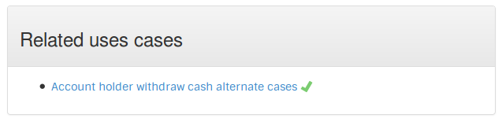

# Links use cases together
Add a public field, it'll be run as a related use case with SimpleFunctionalTest.

    ...
	public class AccountHolderWithdrawCash {
	    ...
        public  AccountHolderWithdrawCashAlternateCases alternateCases = new AccountHolderWithdrawCashAlternateCases();
        ...

A new section is added  with all related use cases:

[Back](../README.md#other-fixtures)
